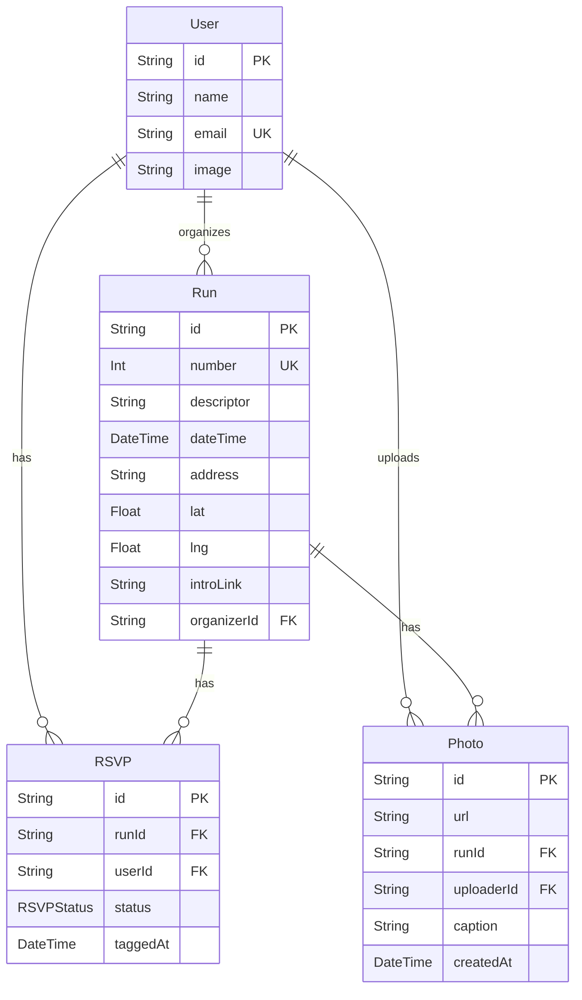

### Architectural Thoughts

- **Database Choice:** The Prisma schema implies a relational database. The specific choice (e.g., PostgreSQL, MySQL, SQLite) will influence connection strings and potentially some database-specific features, but Prisma abstracts most of this.
- **Prisma as ORM:** This is a core architectural decision. It provides type safety, migration management, and a fluent API for database interactions.
- **Schema Location:** The schema is defined in `prisma/schema.prisma`, which is standard practice.
- **Data Integrity:** Relationships and constraints defined in the schema (e.g., `@unique`, foreign keys implied by `@relation`) are crucial for maintaining data integrity at the database level.
- **Scalability:**
  - Consider indexing for frequently queried fields (e.g., `User.email`, `Run.number`, `RSVP.runId`, `RSVP.userId`). Prisma allows defining indexes in the schema.
  - For very large datasets or high-traffic applications, connection pooling and read replicas might be necessary later, configured at the database and infrastructure level.
- **Modularity:** The current schema is relatively self-contained. As the application grows, if new, largely independent domains of data emerge, consideration might be given to splitting the schema or microservice architectures, but that is beyond this initial phase.

### Visual Sketches (Markdown Descriptions)

Since this is about data modeling, a visual sketch would be an Entity-Relationship Diagram (ERD).

**ERD Sketch (Conceptual):**

_(Note: `PK` = Primary Key, `FK` = Foreign Key, `UK` = Unique Key)_

### Component Interactions (Conceptual - for Data Management UI if built)

If a simple admin UI (as per Option 1 in `spec.md`) were to be built for managing this data:

1.  **User List/Form:**
    - Displays a table of users.
    - Form for creating/editing a user with fields: `name`, `email`, `image`.
2.  **Run List/Form:**
    - Displays a table of runs.
    - Form for creating/editing a run: `number`, `descriptor`, `dateTime`, `address`, `lat`, `lng`, `introLink`.
    - A dropdown/search to select an existing `User` as the `organizer`.
3.  **RSVP List/Form (Likely more contextual):**
    - Might be viewed in the context of a `Run` or a `User`.
    - Form for creating/editing an RSVP: Select `Run`, `User`, `status` (`YES`, `NO`, `MAYBE`), `taggedAt` (datetime picker).
4.  **Photo List/Form (Likely more contextual):**
    - Viewed in context of a `Run`.
    - Form for uploading a photo: `url` (or file upload field), select `Run`, `uploaderId` (often pre-filled with logged-in user), `caption`.

These interactions would primarily involve making API calls to a backend that uses the Prisma client to perform CRUD operations based on these models.
