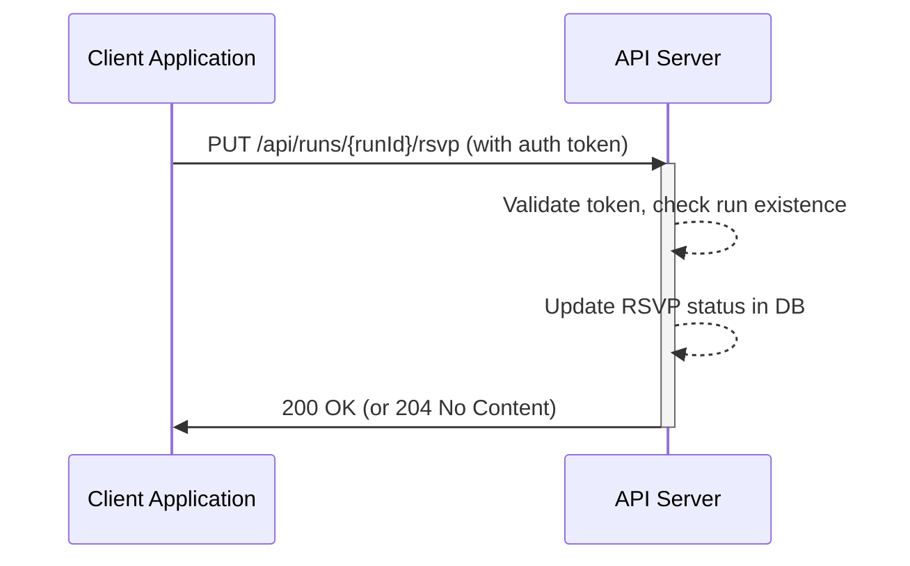
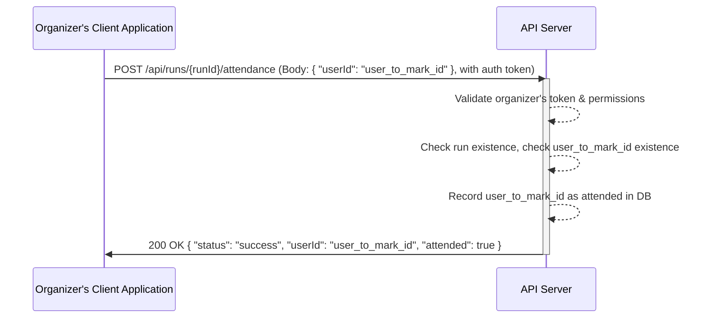
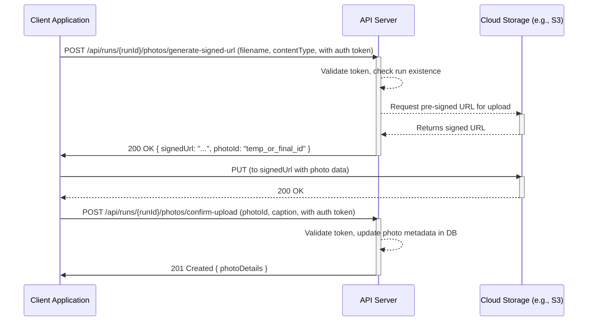

# API Design Considerations - Phase 4 Endpoints

## Architectural Thoughts

This API will serve as a foundational layer for managing "Runs," user interactions (RSVPs, attendance), and associated media (photos). The architecture should prioritize:

- **Clarity and Consistency:** Endpoints should be intuitive, following RESTful principles where appropriate. Naming conventions for paths, parameters, and response fields should be consistent across the API.
- **Scalability:** Design with future growth in mind, especially for photo uploads and run listings. (As noted in `spec.md`, using signed URLs for photo uploads is a key consideration here).
- **Maintainability:** A clear structure and good documentation (e.g., OpenAPI/Swagger specs) will be crucial.
- **Security:** Authentication and authorization are paramount and need to be robustly designed and implemented (currently an open question).
- **Developer Experience:** The API should be easy for developers to understand, integrate with, and debug.

## Applying SLC Principles (Simple, Lovable, Complete) to API Design

The concept of "Simple, Lovable, and Complete" (SLC), while often discussed in the context of UI/UX, offers valuable insights for API design as well. The goal is to create an API that developers _want_ to use because it solves their problems effectively and elegantly.

- **Simple:**

  - **Focused Endpoints:** Each endpoint should have a clear, well-defined purpose. Avoid overly complex endpoints that try to do too many things.
  - **Intuitive Naming:** Use clear, predictable names for resources and actions (e.g., `/runs`, `/runs/{id}/rsvp`).
  - **Minimalism:** Request and response payloads should contain only necessary information. Avoid clutter.
  - **Easy Authentication:** While robust, the authentication mechanism should be straightforward for developers to implement on the client-side.
  - **Example:** The proposed `PUT /api/runs/[id]/rsvp` for toggling RSVP status is simple and directly addresses a user need. It avoids unnecessary complexity for a common action.

- **Lovable (for Developers):**

  - **Excellent Documentation:** Clear, comprehensive, and easily accessible API documentation is key. Interactive documentation (e.g., Swagger UI) is highly desirable.
  - **Consistent Error Handling:** Provide meaningful and consistent error messages. Developers should be able to understand what went wrong and how to fix it.
  - **Predictable Behavior:** The API should behave as expected. Idempotent operations (like `PUT` for updates, `DELETE`) should be truly idempotent.
  - **Performance:** A snappy, responsive API is a lovable API. Optimize queries and processing.
  - **Thoughtful Design Patterns:** Using patterns like signed URLs for uploads can be "lovable" because it offloads work from the client and leverages efficient cloud services, even if it adds a slight initial learning curve. It shows foresight in design.
  - **Example:** Providing clear, actionable error messages like `{"error": "Run not found", "details": "No run exists with ID 123"}` is more lovable than a generic `500 Internal Server Error`.

- **Complete (for its defined scope):**
  - **Addresses Core Use Cases:** The initial set of API endpoints should fully cover the primary functionalities outlined: Runs CRUD, RSVP/Attendance, and basic Photo Uploads.
  - **Handles Edge Cases Gracefully:** Consider and document behavior for edge cases (e.g., trying to RSVP to a non-existent run, uploading an invalid file type).
  - **Self-Contained (for its purpose):** For the defined features, developers shouldn't need to resort to workarounds or access underlying data stores directly because of API limitations.
  - **Example:** The `GET /api/runs/[id]` endpoint should be complete in the sense that it returns all _relevant_ information for that run, including attendee counts and photo references, so a client doesn't need to make multiple subsequent calls for basic display.

## Visual Sketches / Interaction Flows (Conceptual for API)

While not visual in the UI sense, we can sketch out API interaction flows:

**1. User RSVPs for a Run:**

**2. Organizer Marks a User as Attended:**

**3. User Uploads a Photo (using Signed URL approach):**

## Component Interactions (Logical Components)

- **Authentication Service:** Handles token validation for all incoming requests.
- **Run Service:** Manages CRUD operations for runs.
- **RSVP Service:** Handles logic for RSVPing.
- **Attendance Service:** Handles logic for marking attendance, interacts with Run Service and User Service. Requires authorization checks to ensure only permitted users (e.g., organizers) can mark attendance.
- **Photo Service:** Manages photo metadata and orchestrates uploads (e.g., signed URL generation).
- **Database:** Persistent storage for all data.
- **Cloud Storage (Optional but Recommended):** For storing photo files.

## Key Design Decisions to Reiterate (from spec.md)

- **Photo Uploads:** Leaning towards signed URLs for scalability and offloading.
- **Run List Retrieval:** Implementing filtering, sorting, and pagination from the start.

Adopting these principles and considerations will help in building a robust, developer-friendly API that not only meets the functional requirements but is also a pleasure to work with.
